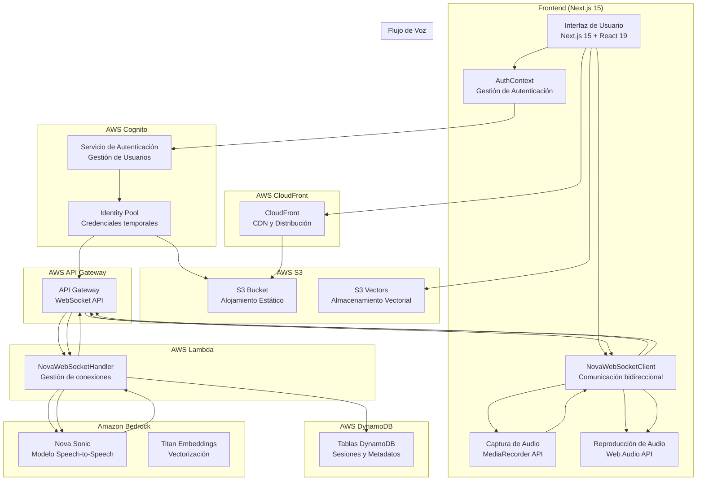
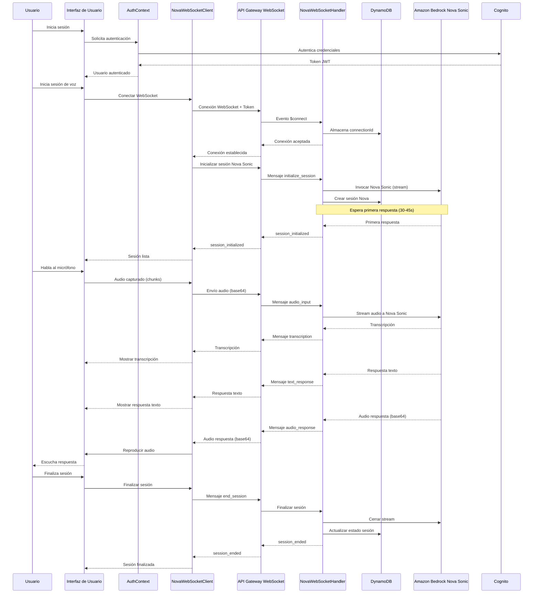
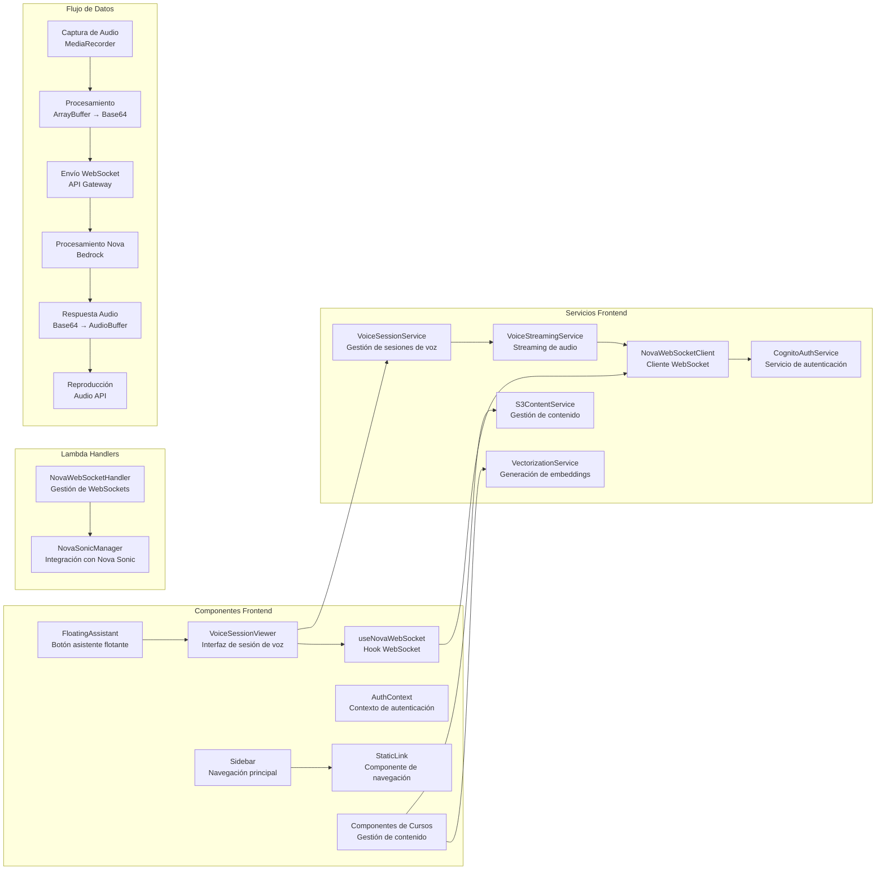
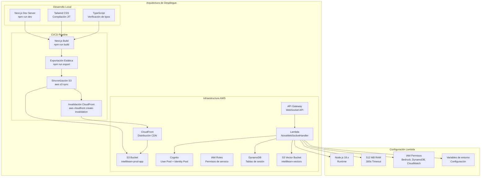

# Arquitectura Completa de CognIA IntelliLearn

## Arquitectura General del Sistema

## Flujo de Comunicación Speech-to-Speech

## Componentes y Servicios

## Arquitectura de Despliegue

## Descripción de Componentes Principales

### Frontend (Next.js 15)

- **Next.js 15**: Framework React con App Router, Server Components y exportación estática
- **React 19**: Biblioteca UI con características concurrentes y Suspense
- **TypeScript**: Tipado estático para desarrollo robusto
- **TailwindCSS**: Framework CSS utilitario para diseño neumórfico
- **Framer Motion**: Animaciones y transiciones fluidas

### Componentes Clave

- **VoiceSessionViewer**: Interfaz principal para sesiones de voz con Nova Sonic
- **useNovaWebSocket**: Hook personalizado para gestionar conexiones WebSocket
- **AuthContext**: Contexto global para autenticación con Cognito
- **StaticLink**: Componente para navegación compatible con exportación estática
- **FloatingAssistant**: Botón asistente flotante para acceso rápido al chat

### Servicios Backend

- **NovaWebSocketHandler (Lambda)**: Gestiona conexiones WebSocket y sesiones Nova Sonic
- **NovaSonicManager**: Integración con Amazon Bedrock Nova Sonic
- **Amazon Bedrock**: Servicios de IA para Speech-to-Speech y embeddings
- **DynamoDB**: Almacenamiento de sesiones y metadatos
- **S3 Vectors**: Almacenamiento vectorial para búsqueda semántica

### Flujo de Comunicación

1. **Autenticación**: Cognito proporciona tokens JWT para autenticación
2. **Conexión WebSocket**: Establecimiento de conexión bidireccional vía API Gateway
3. **Inicialización de Sesión**: Lambda inicia sesión con Nova Sonic (30-45s)
4. **Streaming de Audio**: Captura y envío de audio en tiempo real
5. **Procesamiento Nova Sonic**: Conversión speech-to-speech en Bedrock
6. **Respuesta**: Devolución de transcripción, texto y audio de respuesta
7. **Reproducción**: Decodificación y reproducción del audio de respuesta

### Despliegue

- **Build**: Compilación Next.js con exportación estática
- **S3**: Alojamiento de archivos estáticos
- **CloudFront**: CDN para distribución global
- **Lambda**: Funciones serverless para WebSocket
- **API Gateway**: Endpoint WebSocket para comunicación bidireccional

## Consideraciones Técnicas

### Rendimiento

- **Cold Start**: Nova Sonic puede tardar 30-45s en inicializar
- **Timeout**: Configuración de timeout de 60s en frontend y 30s en Lambda
- **Chunking**: Procesamiento de audio en chunks para evitar sobrecarga

### Seguridad

- **Cognito**: Autenticación y autorización de usuarios
- **IAM**: Permisos granulares para servicios AWS
- **Identity Pool**: Credenciales temporales para acceso a servicios AWS

### Escalabilidad

- **Serverless**: Arquitectura sin servidor para escalar automáticamente
- **CloudFront**: Distribución global de contenido
- **S3 Vectors**: Almacenamiento vectorial escalable para búsqueda semántica